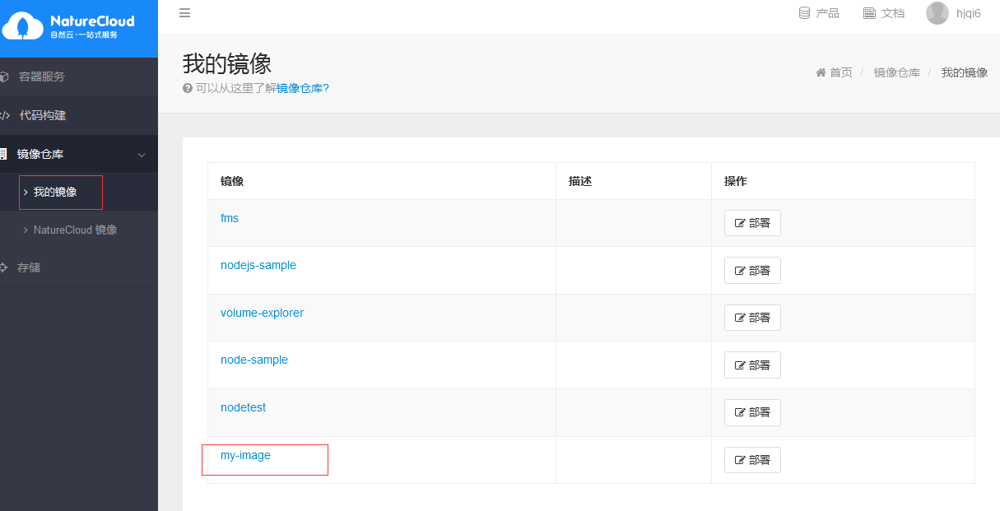

本地生成镜像需要做如下事情

### 搭建Docker环境
关于如何搭建docker环境，不清楚的同学可以参考
[docker 安装](../../../q&a/docker-q&a)

### 生成镜像
通过docker build命令生成镜像

例如，需要将dockerfile生成自己的镜像
	
	root@node:/data01/test# ls
	Dockerfile   run.sh
	root@node:/data01/test# docker build -t my-image .
	Step 1 : FROM nginx
	 ---> 89732b811e7f
	Step 2 : COPY conf.d/default.conf /etc/nginx/conf.d
	 ---> 7af820851f3b
	Removing intermediate container dbfa4778c121
	Successfully built 7af820851f3b
	root@node:/data01/test# docker images | grep my-image
	my-image                                                   latest               7af820851f3b        About a minute ago   182.8 MB
	
### 上传镜像
通过docker push上传镜像。

接着上一个例子，我们上传刚刚制作完的那个my-image的镜像。首先我们需要打tag，用于push到目标registry
	
	root@node:/data01/test# docker tag 7af820851f3b naturecloud.io/hjqi/my-image
	
	#7af820851f3b    是刚才生成镜像的IMAGE ID
	#naturecloud.io  是平台仓库的地址
    #hjqi			 是namespace，和用户名一致

	root@node:/data01/test# docker images| grep naturecloud.io/hjqi/my-image         
 	naturecloud.io/hjqi/my-image                            latest               7af820851f3b        15 minutes ago      182.8 MB
	
	root@node:/data01/test#docker push naturecloud.io/hjqi/my-image
	#将镜像推送到平台上，在 推送成功后，平台上就可以显示自己的镜像了

