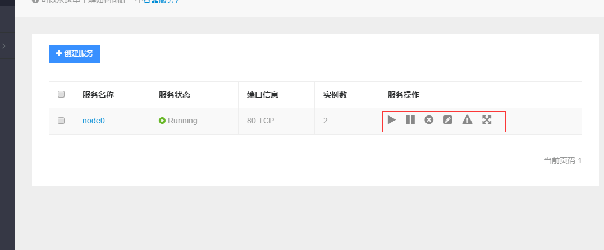
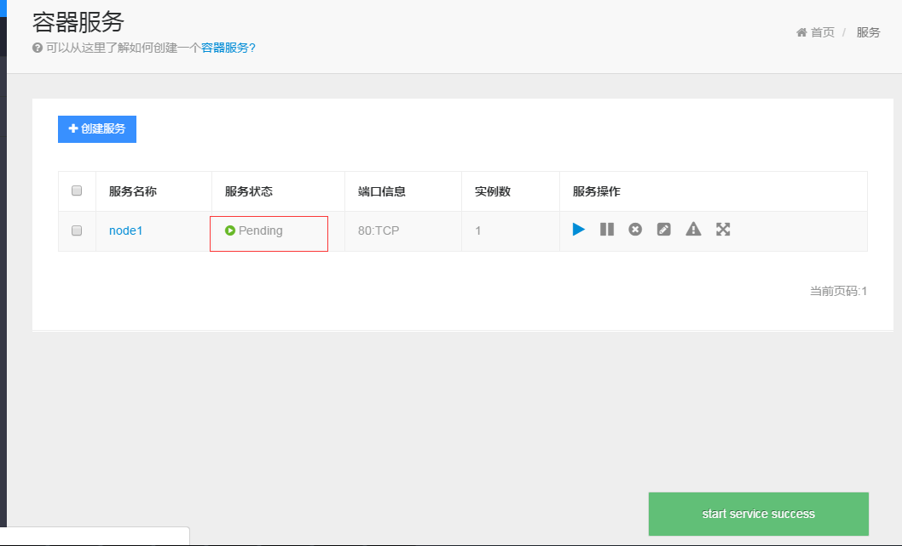
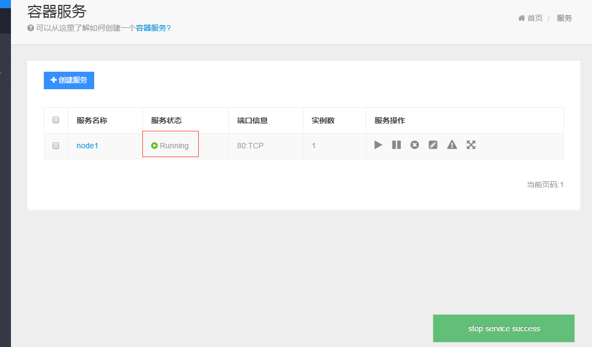
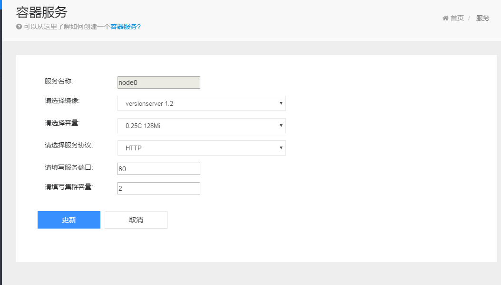
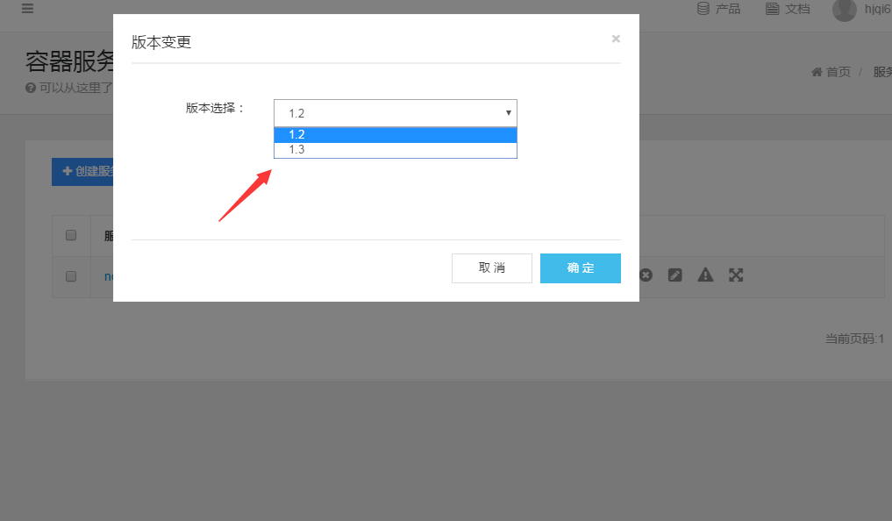
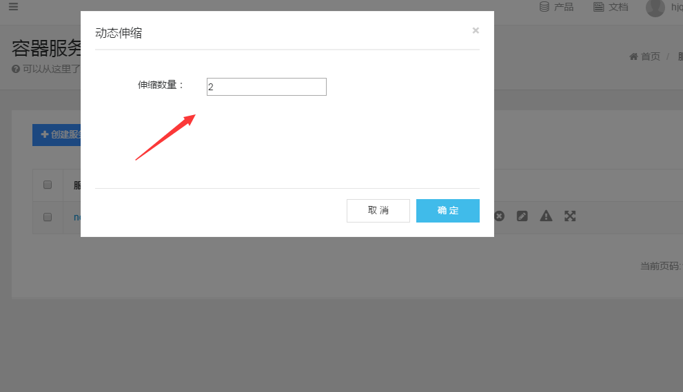
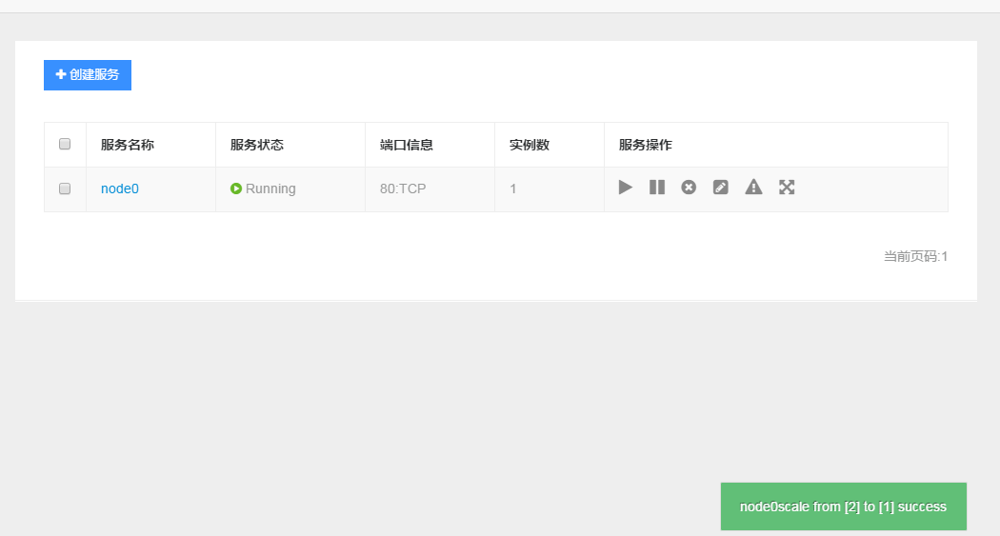

在服务列表页面可以看到应用的右侧有一排操作

> 服务启动 在服务停止状态下，开启服务。
> 
> 停止服务 在服务运行状态下，停止服务。
> 
> 删除服务 将服务从平台上删除
> 
> 修改服务 修改服务相关参数
> 
> 版本变更  应用灰度升级，可以在服务不停的状态下进行版本迭代。
> 
> 伸缩扩容  可以根据业务的负载，动态调整应用的实例数。

1. 服务启动

	点击启动后，会提示服务启动成功，服务的状态会变为pending,等到服务真正启动后，才会变为running。
	
	

2. 服务停止
	点击停止后，会提示服务停止成功，服务的状态会等到应用真正退出后才会置为停止。	

	

3. 删除服务

	点击后该服务会从平台上删除。

4. 修改服务

	可以修改服务的运行容量，版本，端口和实例数。

	

5. 版本变更

	可以选择应用的不同版本，进行变更。

	

6. 伸缩扩容

	输入目标数量，可以动态调整当前的实例数量

	
	
	将2个实例调整为1个实例
	
	
